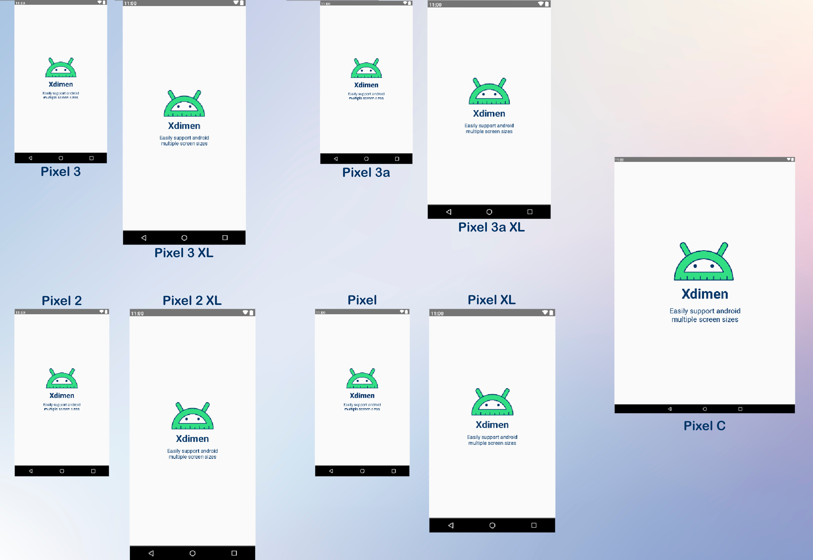

# Xdimen

[](https://plugins.gradle.org/plugin/io.github.islamkhsh.xdimen)

<p align="center"></p>
Support multiple screen sizes easily by scaling your dimensions.

## How does Xdimen work?

When you have a UI design with a specific dimension, and you need to support different mobiles or tablets in portrait or
landscape. This case **Xdimen** can help you to generate scalable dimesions for common devices' screen sizes.

Xdimen generates an alternative res directory for every common screen width (configurable) and scales your design
dimensions.

> Xml resources are generated with help of [kotlin xml builder](https://github.com/redundent/kotlin-xml-builder)

Find more about Xdimen [here](https://medium.com/@islam.khaled50/android-support-multiple-screen-sizes-by-scaling-dimensions-5fd9bd80821)


## Usage


### Add to project

Xdimen must be applied in an android project.

<details>
<summary>Groovy</summary> 
  
````groovy
  plugins {
    id 'io.github.islamkhsh.xdimen' version "$latest_version"   
    // agp plugin
  } 
````
</details>

<details open>
<summary>Kotlin</summary> 
  
````kotlin
  plugins {                         
    id("io.github.islamkhsh.xdimen") version "$latest_version"  
    // agp plugin
  }
````
</details>

### Configure Xdimen
All properties are optional, only `designWidth` is required. Properties are discussed in more detail in below section.

<details>
<summary>Groovy</summary> 
  
````groovy
  xdimen {
    deleteOldXdimen = true
    designWidth = 411 // required
    designDpi = mdpi()
    targetDevicesWidth = [360, 375, 411]
    dimensRange {
        minDimen = -10
        maxDimen = 600
        step = 0.5d
    }
    fontsRange {
        minDimen = 10
        maxDimen = 60
        step = 1.0d
    }
}
````
</details>

<details open>
<summary>Kotlin</summary> 
  
````kotlin
  xdimen {
    deleteOldXdimen.set(true)
    designWidth.set(411) // required
    designDpi.set(mdpi())
    targetDevicesWidth.set(phonePortrait)
    dimensRange {
        minDimen.set(-10)
        maxDimen.set(500)
        step.set(0.5)
    }
    fontsRange {
        minDimen.set(10)
        maxDimen.set(60)
        step.set(1.0)
    }
}
````
</details> 

### Use scaled dimens
After generate xdimen resources (see next section) you can use the dimens 
```xml
   <TextView android:layout_width="@dimen/x100dp"    # width in design is 100dp
             android:layout_height="@dimen/x50_5dp"  # height in design is 50.5dp
             android:padding="@dimen/neg_x6_5dp"     # padding in design is -6.5dp
             android:textSize="@dimen/x12sp"         # textSize in design is 12sp
             />
```

## Tasks

To execute a task, make sure you execute it on an android project using one of these ways
- `$ gradle :prjectName:taskName`.
- From gradle tool window under `android` group.
- From `Run AnyThing` window.

### `generateXdimen`

Generates alternative resources for every device width in `targetDevicesWidth` set and for every created resource
qualifier it scales the dimensions to fit with this width. It uses configured properties to calculate a scaling factor,
get the range of dimensions to generate and the list of screen widths' to target.

### `deleteXdimen` 

Delete the previous generated xdimen resources unless you renamed the res file or dir. It will be executed
before `generateXdimen` if you set `deleteOldXdimen` property by true.

## Configuration properties

<details>
<summary><b>deleteOldXdimen</b></summary>  

By setting it when you execute `generateXdimen` task `deleteXdimen` will be executed first to delete all previous
generated xdimen resources and their dirs if the directory contains only `xdimen.xml` file.

> If you renamed the `xdimen.xml` file or its directory for any reason, this file won't be deleted. 
  
> Default value: **true**.
</details>

<details>
<summary><b>designWidth</b></summary>  

The value of screen width of your design in `dp` unit. It will be used with `designDpi` to calculate the
relativeDesignWidth (width relative to main density `mdpi`) and then calculate a scaling factor for every screen width
in `targetDevicesWidth`.

> If your design is in `px` set its width in this property and set `designDpi` to be `mdpi` as in mdpi 1px = 1dp.

> No default value because it's required and must be configured.
</details>

<details>
<summary><b>designDpi</b></summary>  
  
The design screen density (dot per inch) [see more](https://developer.android.com/training/multiscreen/screendensities). This will be used with `designWidth` to calculate the relativeDesignWidth.

> Default value is: **mdpi**

> Predefined densities: for every density in [common densities](https://developer.android.com/training/multiscreen/screendensities#TaskProvideAltBmp) there's a method with its name ( `ldpi()`, `mdpi()`, `hdpi()`, ... etc), Also there's a method to set custom density `dpi(value)`.
</details>

<details>
<summary><b>targetDevicesWidth</b></summary>  

The width of screens of devices which you target. For every width in this list, an alternative resource will be generated
with scaled dimensions.

ex: if the list is [350, 400] then

  ```
  ...
-> values/xdimen.xml            # Devices with screen-width less than 350dp.
-> values-w350dp/xdimen.xml     # 350dp <= screen-width < 400dp
-> values-w400dp/xdimen.xml     # screen-width >= 400dp
  ...
```
  
> You can use  a predefined set as it's, adds or removes from it, or provide your own set.

> Default value is: **[designWidth]** set of designWidth provided value.

> > Predefined sets for common devices:
>  - `phonePortrait`: common phones in portrait orientation.
>  - `phoneLandscape`: common phones in landscape orientation.
>  - `tabletPortrait`: common tablets in portrait orientation.
>  - `tabletLandscape`: common tablets in landscape orientation.
>  ####
>  - `devicesInPortrait`: common phones and tablets in portrait.
>  - `devicesInLandscape`: common phones and tablets in landscape.
>
> You can combine multiple devices list, but I recommend not to target both portrait and landscape unless you provide a custom layout for landscape or using [Pane Layout](https://developer.android.com/guide/topics/ui/layout/twopane).
>
> These lists were collected from many sources: [Wikipedia](https://en.wikipedia.org/wiki/Comparison_of_high-definition_smartphone_displays#720p_by_1280_(HD_ready)),
[ScreenSize](https://screensiz.es/), [Pixensity](https://pixensity.com/list/) and others.
</details>
  
  <details>
<summary><b>dimensRange</b></summary>  
  
The range of dimensions you want to be generated and scaled.
- `minDimen`: the minimum dimen to be generated.
- `maxDimen`: the maximum dimen to be generated.
- `step`: the step between two generated dimen.
    
> Default value: **minDimen=-10**,  **maxDimen=600**,  **step=1.00**.

</details>

   <details>
<summary><b>fontsRange</b></summary>  

The same of `dimensRange` but for fonts dimensions range.

> Default value: **minDimen=6**,  **maxDimen=48**,  **step=1.00**.

</details>

## Screenshots


